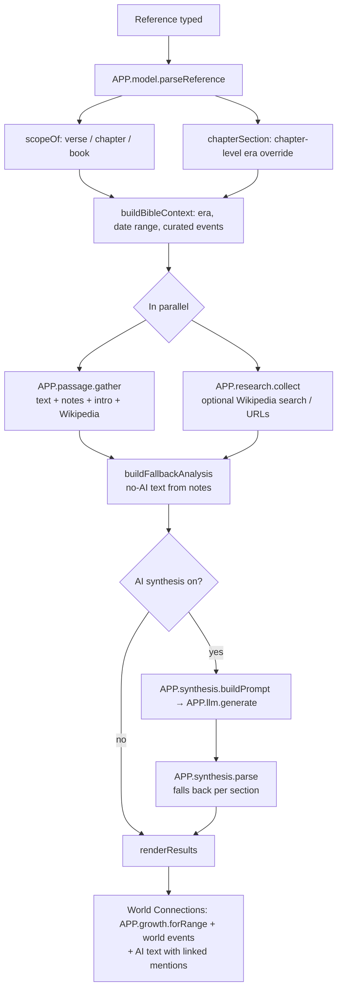
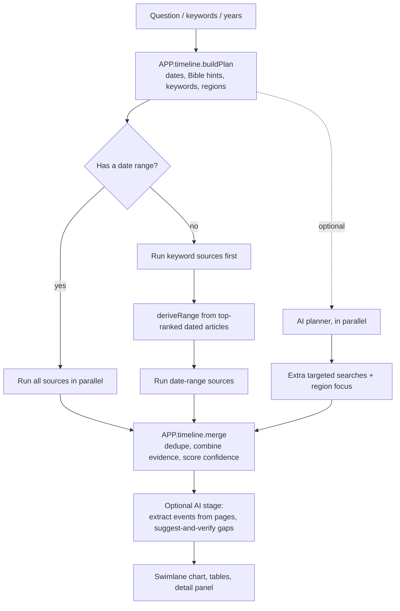

# Bible World Context — Technical Documentation

This document explains how the app works end to end: what it does, how the code is organized, where every piece of data
comes from, exactly how AI is used (and constrained), and how to extend or troubleshoot it.

**Contents**

1. [Purpose](#1-purpose)
2. [Running the app](#2-running-the-app)
3. [Using the app](#3-using-the-app)
4. [Architecture](#4-architecture)
5. [Context Analysis: how a Bible search works](#5-context-analysis-how-a-bible-search-works)
6. [Timeline Search: how a multi-source search works](#6-timeline-search-how-a-multi-source-search-works)
7. [Data sources](#7-data-sources)
8. [How AI is used](#8-how-ai-is-used)
9. [Key algorithms](#9-key-algorithms)
10. [Curated data](#10-curated-data)
11. [Settings and storage](#11-settings-and-storage)
12. [Security and privacy](#12-security-and-privacy)
13. [Extending the app](#13-extending-the-app)
14. [Troubleshooting](#14-troubleshooting)
15. [Known limitations](#15-known-limitations)

---

## 1. Purpose

Bible World Context shows **Biblical history within world history**, and how the events of the wider world shaped the
**beginning and growth of Christianity**.

It has two workspaces:

| Workspace | Question it answers | Example |
|---|---|---|
| **Context analysis** | "What is this passage, what was its world like, and how does that world connect to Christianity's growth?" | `Acts 17:2`, `Isaiah 41`, `Revelation` |
| **Timeline search** | "What was happening across the world during this period?" | *"What was happening in China and India during the Babylonian exile?"* |

Design principles that run through the code:

- **Local-first and free.** No build step, no server, no paid APIs. All public sources are free and keyless; licensed
  Bible translations use the user's own free keys.
- **Every claim is traceable.** Each piece of content is labeled with its source and perspective, and links back to it.
- **AI is optional and constrained.** Everything works without AI. When AI is on, it may only use material the app
  collected, its output is validated, and anything it names is linked back to evidence.
- **Honest about perspective.** Interpretation follows a selectable lens (Baptist by default); historical claims may come
  from any source but are labeled, and critical-scholarship views are marked as such.

---

## 2. Running the app

**Recommended:** double-click **`Start Bible World Context.bat`**. It:

1. Checks that Python is installed.
2. Starts Python's built-in web server for this folder at `http://localhost:5510` (in a minimized window named
   "Bible World Context server").
3. Opens that address in your browser.

Close the server window to stop the app.

**Why a launcher instead of double-clicking `index.html`?** A page opened as a file sends `Origin: null` with its requests,
and Ollama refuses those by default. A page served from `localhost` is accepted. The launcher avoids having to set
`OLLAMA_ORIGINS=*`, which would let *every* website you visit use your local Ollama.

Opening `index.html` directly still works for everything except the local AI model.

**Requirements**

| Need | For |
|---|---|
| A modern browser (Chrome, Edge, Firefox, Safari 16.4+) | Everything |
| Internet access | Scripture text, commentary, history sources |
| Python 3 | The launcher (any static web server works) |
| Ollama or an OpenAI-compatible server *(optional)* | AI features |
| ESV / API.Bible keys *(optional)* | ESV, NIV, and other licensed translations |

---

## 3. Using the app

### Context analysis

1. Enter a **Bible reference**. The level of detail depends on what you enter:
   - **Verse** (`Isaiah 41:10`, `1 Kings 18:20-39`): the verse highlighted within ±3 verses of context, study notes on
     those verses, and encyclopedia notes on that specific verse when they exist.
   - **Chapter** (`Isaiah 41`): the full chapter with section headings, study notes through the chapter, and where it
     sits in the book.
   - **Book** (`Isaiah`): the book's introduction — setting, summary, authorship, date, and message.
2. Choose a **Translation** (BSB by default) and an **Interpretive lens** (Baptist by default).
3. Optionally enable **AI synthesis** (uses the model chosen in **AI settings**).
4. Select **Analyze Biblical Context**.

Results, top to bottom:

| Section | Content |
|---|---|
| Bottom Line | A short answer; the passage words plus the key note (or AI summary) |
| The Verse / Chapter / Book | Passage text, Tyndale study notes, the book's setting, Wikipedia background (collapsed), further-study links |
| Historical Setting | Era summary plus Tyndale's "Setting" and "Date of Writing" (or AI) |
| Original-Setting Context | Tyndale's historical notes for the passage (or AI) |
| **World Connections** | Curated developments of this era that shaped Christianity's growth, the era's world events, and optional AI synthesis |
| Timeline View | Swimlane chart of Biblical, world, and regional events for the era |
| Regional Comparison, event tables, sources, method notes | Supporting detail |

Clicking any Scripture reference (on a World Connections card or in AI text) starts a new analysis of that passage.
**Explore this period in Timeline search** carries the era's date range into the other workspace.

The left panel also offers **Search a historical setting** (pick a historical anchor such as "Pauline mission period", or
enter years, and filter by region) and optional **public-source research** (Wikipedia search and your own URLs).

### Timeline search

1. Type a question, keywords, a Bible reference, or leave it blank and enter **start/end years** (negative = BCE).
2. Choose sources, search depth, and optional AI assistance.
3. Results stream in as each source finishes. The status chips show each source's progress.

Then:

- **Chart:** one lane per region (or per domain, category, or source). Drag to pan, Ctrl + scroll to zoom, click an event.
- **Event detail:** evidence trail, "meanwhile elsewhere" events, and **Deep dive with AI**.
- **Period synthesis:** an AI summary of the events in view, with citations that link to event records.
- **Filters and exports:** filter by text, category, and confidence; export CSV, Markdown, or JSON.

---

## 4. Architecture

### No build, one namespace

The app is plain HTML, CSS, and JavaScript (ES5 style, `var` and function expressions). There is no bundler, framework,
or package manager. Each file in `js/` is an immediately-invoked function that attaches one module to the global `APP`
object, and `index.html` loads them in order:

```
00-core → 01-dom → 02-utils → 03-data → 04-clean → 05-model → 06-analytics → 07-charts → 08-tables
→ 09-ollama → 10-sources → 11-research → 12-synthesis → 13-http → 14-llm → 15-timeline-model
→ 16-timeline-providers → 17-timeline-ai → 18-timeline-view → 19-timeline-controller
→ 20-passage → 21-growth → 99-controller
```

A module may *call* a module that loads later, as long as the call happens at runtime (after all scripts load), not while
the file is being evaluated. `99-controller.js` runs last and starts the app.

### File map

| File | Module | Responsibility |
|---|---|---|
| `index.html` | — | Markup for both workspaces and the settings dialog |
| `styles.css` | — | Dark theme, design tokens in `:root`, all component styles |
| `00-core.js` | `APP.config`, `APP.state`, `APP.core` | Configuration, shared state, audit log, saved settings |
| `01-dom.js` | `APP.dom`, `APP.tdom` | Element references for Context analysis and Timeline search |
| `02-utils.js` | `APP.utils` | HTML escaping, date formatting, safe Markdown, encoding repair, downloads |
| `03-data.js` | `APP.data` | Eras, the 66 books, chapter-level eras, book codes, Wikipedia titles, abbreviations |
| `04-clean.js` | `APP.clean` | Input normalization |
| `05-model.js` | `APP.model` | Reference parsing, scope, era selection, context building, no-AI analysis text |
| `06-analytics.js` | `APP.analytics` | Metrics and warnings for the audit panel |
| `07-charts.js` | `APP.charts` | Context-analysis timeline (reuses the swimlane renderer) and regional cards |
| `08-tables.js` | `APP.tables` | Event, source, metric, and audit-log tables |
| `09-ollama.js` | `APP.ollama` | Ollama transport: models, chat, streaming, JSON schema |
| `10-sources.js` | `APP.sources` | Curated events, historical anchors, continent/region lists |
| `11-research.js` | `APP.research` | Optional Wikipedia search and user-URL reading for Context analysis |
| `12-synthesis.js` | `APP.synthesis` | Context-analysis AI prompt and response parser |
| `13-http.js` | `APP.http` | Fetch with timeout, cancellation, retry, concurrency limit, and caching |
| `14-llm.js` | `APP.llm` | Provider-neutral AI layer (Ollama or OpenAI-compatible), JSON handling, error hints |
| `15-timeline-model.js` | `APP.timeline` | Event records, date parsing, region/category inference, merging, confidence, search plans |
| `16-timeline-providers.js` | `APP.timelineProviders` | The Timeline search data sources |
| `17-timeline-ai.js` | `APP.timelineAI` | Timeline AI tasks: planning, extraction, gap-fill, prompts |
| `18-timeline-view.js` | `APP.timelineView` | Swimlane chart, tables, detail panel, exports |
| `19-timeline-controller.js` | `APP.timelineController` | Timeline search orchestration, rendering, interaction |
| `20-passage.js` | `APP.passage`, `APP.passageView` | Passage text, study notes, background, World Connections rendering |
| `21-growth.js` | `APP.growth` | Curated developments that shaped Christianity's growth |
| `99-controller.js` | `APP.controller` | Context analysis controller, settings dialog, workspace tabs, startup |

### Rendering approach

Views build HTML strings and assign them with `innerHTML`. **Every piece of external or AI text passes through
`APP.utils.escapeHtml` first**, and links pass through `APP.utils.safeUrl` (only `http`/`https` allowed). AI Markdown is
rendered by `APP.utils.renderMarkdown`, which escapes first and then applies a small safe subset (headings, bullets,
bold, italics, citation buttons).

---

## 5. Context Analysis: how a Bible search works



**Step by step** (`99-controller.js` → `handleBibleSearch` → `runAnalysis` → `collectResearchThenAnalyze` → `finishAnalysis`):

1. **Parse** (`APP.model.parseReference`). Matches the longest book name first, then common abbreviations
   (`APP.data.aliases`, e.g. `1 cor`, `jn`), then chapter and verse (`41`, `41:7`, `41:4-10`).
2. **Scope** (`scopeOf`). A verse number means verse scope, a chapter number means chapter scope, otherwise book scope.
3. **Era** (`chapterSection`). Each book has a default era (`APP.data.books`), but some books span several:
   `APP.data.chapterEras` maps chapter ranges to eras. For example, Isaiah 1–39 → Assyrian crisis, 40–55 → Babylonian
   exile, 56–66 → Persian period. The note shown explains the choice, giving the traditional authorship view first and the
   critical dating as an alternative.
4. **Context** (`buildBibleContext`). The era's date range selects curated events (`APP.sources.getLocalEvents`) split into
   Biblical and world events.
5. **Passage research** (`APP.passage.gather`), in parallel requests:
   - Passage text in the chosen translation (see [section 7](#7-data-sources)).
   - Tyndale study notes for the chapter, kept only where their verse range touches the requested verses.
   - The Tyndale book introduction (Setting, Summary, Authorship, Date of Writing, Meaning and Message, and
     "Interpreting Revelation" for Revelation).
   - Wikipedia articles for the book and chapter, used only as labeled historical background: verse notes
     (sections titled "Verse 10"), the chapter overview, and "place in the book" sentences.
   If a licensed translation fails (for example, no key), the passage falls back to the BSB and says so.
6. **No-AI analysis** (`buildFallbackAnalysis`). Builds each section from the collected notes, so the page is substantive
   without AI:
   - `describePassage` → Bottom Line (the words, then the relevant Tyndale note)
   - `settingText` → Historical Setting (era summary, Tyndale "Setting" and "Date of Writing")
   - `originalContextText` → Original-Setting Context (Tyndale notes that mention kings, empires, cities, and dates)
   - `fallbackConnections` → World Connections introduction
7. **AI synthesis** (optional). See [section 8](#8-how-ai-is-used). Any section the model omits keeps its no-AI text.
8. **Render** (`renderResults`). The passage section comes from `APP.passageView.buildFocus`; World Connections from
   `APP.passageView.buildConnections`, which shows the AI text (if any), a card for each curated development overlapping
   the era (`APP.growth.forRange`), and the era's world events.

---

## 6. Timeline Search: how a multi-source search works



1. **Plan** (`APP.timeline.buildPlan`). Works out the date range, in priority order:
   - Years typed in the start/end fields.
   - A date in the question: "586 BC", "580s BC", "1st century", "30–40 CE", "between 30 and 40".
   - A Bible hint: a reference (`Acts 18`), a book name, or a known event ("crucifixion" → 29–34 CE, "Babylonian exile"
     → 605–539 BCE, "Paul" → 45–65 CE).
   - Otherwise none: the range is inferred from results.

   It also extracts keywords (stop words removed) and detects mentioned regions ("China" → East Asia).
2. **Sources** run through `runProvider`, each with a status chip, a progress line, and `emit()` to stream results in.
   A source's failure is recorded on its chip and never stops the search.
3. **Keyword-only searches** (no dates) run the keyword sources first. `deriveRange` then anchors on the best-ranked,
   precisely dated event and widens only for nearby precise events (not lifespans or century-precision items). The
   date-range sources run next.
4. **Merge** (`APP.timeline.merge`). Each new record is compared with existing ones (see
   [section 9](#9-key-algorithms)). Matches are combined, pooling their evidence trails; the rest are added.
5. **Render** is throttled to about five times a second while results stream in.
6. **Stop** cancels every in-flight request through a shared `AbortController`. A newer search cancels an older one, and
   only the current search may report completion.

**Depth settings** (`APP.timeline.depthSettings`):

| Depth | Chronicle pages | Search results | Query variants | Wikidata limit | Scholarship | AI suggestions |
|---|---|---|---|---|---|---|
| Quick | 3 | 10 | 1 | skipped | 5 | 6 |
| Standard | 8 | 20 | 2 | 150 | 8 | 10 |
| Deep | 16 | 40 | 3 | 300 | 15 | 16 |

---

## 7. Data sources

All sources below allow cross-origin browser requests (CORS), so the app can call them directly.

### Scripture and commentary (Context analysis)

| Source | Endpoint | Provides | Auth |
|---|---|---|---|
| **Free Use Bible API** | `bible.helloao.org/api/{translation}/{BOOK}/{chapter}.json` | BSB (default, with section headings), KJV, NET, WEB | None |
| **Tyndale Open Study Notes** | `bible.helloao.org/api/c/tyndale/…` | Verse/chapter notes and book introductions (evangelical, CC BY-SA) | None |
| **ESV API** (Crossway) | `api.esv.org/v3/passage/text/` | ESV text | Free personal key (`Authorization: Token …`) |
| **API.Bible** | `api.scripture.api.bible/v1/…` | Any translation the key is licensed for, which may include the NIV | Free key (`api-key` header) |
| **Wikipedia** | `en.wikipedia.org/w/api.php` | Historical background: chapter/book articles, verse sections | None |

Books are addressed by standard USFM codes (`ISA`, `REV`, `1CO`) from `APP.data.usfm`. Licensed text (ESV, API.Bible) is
requested with `cache: false`, so it is never stored, and its copyright notice is displayed with the passage.

### Timeline search sources (`16-timeline-providers.js`)

| Source (id) | What it does | Needs |
|---|---|---|
| **Curated dataset** (`curated`) | Built-in Biblical and world events from `APP.sources.events` | A date range |
| **Wikipedia chronicles** (`chronicle`) | Reads Wikipedia's year, decade, century, and millennium pages, which list events by place | A date range |
| **Wikipedia + Wikidata** (`encyclopedia`) | Keyword search, then Wikidata for dates, precision, coordinates, and continent | Keywords or a region |
| **Wikidata dated events** (`wikidata`) | SPARQL query for dated occurrences (battles, sieges, treaties) with English articles | A date range of 400 years or less |
| **OpenAlex scholarship** (`scholarly`) | Academic works for further reading (not plotted) | A topic |
| **Web search** (`web`) | Your own SearXNG instance, if configured | A SearXNG URL |
| **Your URLs** (`urls`) | Reads public pages you list (the site must allow cross-origin reads) | URLs |

**Chronicle page selection** picks the finest level that fits the page budget: individual years for spans of 12 years or
less, then decades (e.g. `580s BC`, `500s BC (decade)`), then centuries, then millennia. Ancient single-year titles
redirect to decade pages, so titles are resolved first and each page is read only once.

### Networking (`13-http.js`)

Every public request goes through `APP.http.request`, which provides:

- **Timeouts** (20 seconds by default; 55 seconds for Wikidata SPARQL).
- **Cancellation** through an `AbortSignal`.
- **Retries with backoff** on HTTP 429/502/503/504 and network errors, honoring `Retry-After`.
- **A concurrency limit** of 4 simultaneous requests, so public APIs are not flooded.
- **Caching:** GET responses are cached in memory and in `sessionStorage` (under 400,000 characters) for the browser
  session, unless the request says `cache: false`.

---

## 8. How AI is used

### 8.1 Providers and transport

AI is optional. **AI settings** (top bar) selects:

| Setting | Values |
|---|---|
| Provider | **Ollama** (`/api/chat`) or **OpenAI-compatible** (`/chat/completions`, e.g. LM Studio, llama.cpp, vLLM, Jan, OpenRouter) |
| Server URL | Default `http://localhost:11434` (Ollama) or `http://localhost:1234/v1` |
| Model | Filled from the server's model list; if the saved model is not installed, the first installed one is chosen |
| API key | Hosted services only; kept in memory, never saved |

`APP.llm` (`14-llm.js`) gives the rest of the app one interface, whatever the provider:

| Function | Purpose |
|---|---|
| `chat(messages, options)` | Send messages; returns text. `options.onToken` streams partial output |
| `chatJson(messages, schema)` | Structured output constrained by a JSON schema; returns a parsed object |
| `generate(prompt)` | Single-message convenience wrapper |
| `listModels()`, `test()` | Model discovery and connection test |
| `explainError(error)` | Turns network, CORS, and "model not found" errors into actionable messages |

Transport details:

- **Ollama:** sends `think: false` (reasoning models such as Qwen3 answer directly) and `num_ctx: 8192`. JSON calls pass the
  schema as `format`. If the server rejects `think`, the request is retried without it.
- **OpenAI-compatible:** JSON calls use `response_format: json_schema`. If the server rejects that, the request is retried
  without it and the JSON is extracted from the text.
- **Streaming:** Ollama streams newline-delimited JSON; OpenAI-compatible servers stream server-sent events. Both are read
  line by line.
- `<think>…</think>` reasoning blocks are always stripped from output.

### 8.2 Where AI is used

| # | Feature | Where | Input | Output | Without AI |
|---|---|---|---|---|---|
| 1 | **Context synthesis** | Context analysis, "Use the configured model" | Passage text, Tyndale notes and introduction, curated developments, world events, Wikipedia background, collected sources | Five sections: Bottom Line, Historical Setting, Original-Setting Context, **World Connections**, Cautions | Sections built from Tyndale notes and curated data |
| 2 | **Question planner** | Timeline search, "Interpret my question" | The question and any known range | Keywords, up to 3 extra searches, up to 4 regions, optional range | Local date parsing and hints |
| 3 | **Event extraction** | Timeline search, "Extract dated events" | Text of web results and your URLs | Dated events tied to the source they came from | Pages listed as sources only |
| 4 | **Suggest and verify** | Timeline search, "Suggest missing events" | The period, thin regions, events already found | Suggested events, each checked against Wikipedia/Wikidata | — |
| 5 | **Event deep dive** | Timeline event detail | The event, full article text, related scholarship, contemporaneous events | A streamed research brief | The same research packet, shown unsummarized |
| 6 | **Period synthesis** | Timeline search | The top events per region in view, scholarship | A streamed comparative overview citing events as `[E#]` | — |
| 7 | **Connection test** | AI settings | — | "CONNECTION OK" | — |

### 8.3 The Context-analysis prompt (`12-synthesis.js`)

`APP.synthesis.buildPrompt` assembles one prompt with these parts, in order:

1. **Goal:** show Biblical history within world history, and how the wider world shaped Christianity's growth.
2. **Interpretive lens** (`APP.synthesis.perspectives`):
   - **Baptist** (default): interpretation consistent with the Baptist Faith and Message (2000), leaning on the Tyndale
     notes.
   - **Evangelical:** a broadly evangelical view of Scripture's authority.
   - **Academic:** a nonsectarian historian's view that describes beliefs without endorsing them.
3. **Source rules:** use only the facts provided; say which source a historical claim comes from; label critical
   scholarship "(critical view)" and give the traditional view alongside it; cite exact Scripture references.
4. **Scope instruction** for verse, chapter, or book.
5. **The material,** labeled by source: passage text, commentary and study notes, the curated developments (with dates,
   connections, and Scripture), the era's world events, Wikipedia background, and any collected evidence.
6. **Output format:** five fixed headings, with World Connections split into "The world at this time", "How the wider world
   shaped this passage", and "How this era shaped Christianity's growth".

`APP.synthesis.parse` is tolerant of model formatting (`## BOTTOM LINE`, `**World Connections:**`) and reads each section
in full. Any missing section falls back to its no-AI text.

### 8.4 Guardrails

Small local models make mistakes, so every AI feature is constrained:

| Risk | Guardrail | Where |
|---|---|---|
| Inventing facts | Prompts forbid facts outside the supplied material; World Connections may only name listed developments and events | `12-synthesis.js`, `17-timeline-ai.js` |
| Unverifiable claims | Development names in AI text are linked to their sources; event names in Timeline summaries link to their records; Scripture references become buttons | `APP.passageView.linkMentions`, `APP.timelineView.linkMentions` |
| Fabricated events | Suggested events are kept only if a dated Wikipedia/Wikidata record with a similar title overlaps the suggested dates; the rest are flagged "unverified" and hidden by default | `suggestAndVerify` |
| Bad dates | Years must fall between 6000 BCE and 2100 CE, with spans under 4,000 years; flipped BCE signs (e.g. 600→586 for 600–586 BCE) are repaired; extracted dates must fall near the period | `yearsValid`, `repairYears` |
| An AI plan overriding the user | Dates typed or written in the question always win; an AI range is used only if none could be found from data | `planQuestion`, `applyAiPlan` |
| Runaway generation | Every JSON array has `maxItems`, and every call has a token cap (1,500 for JSON, 2,000 for text, 2,600 for Context synthesis) | Schemas; `APP.llm.tokenLimit` |
| Malformed JSON | Low temperature (0.1), schema-constrained output, tolerant extraction, one corrective retry | `chatJson`, `extractJson` |
| Slow models | AI planning runs alongside the sources instead of blocking them; there is a 300-second timeout; searches continue if AI fails | `runSearch`, `track` |
| Over-trusting AI | AI-derived events get low confidence (0.40 extracted, 0.30 suggested); AI text is always footnoted with the model's name and a reminder to verify | `PROVIDER_WEIGHT`, footnotes |

**What AI never does:** fetch data itself, decide which sources are trusted, change the curated data, or replace
Scripture text or study notes. It only interprets material the app has already collected.

### 8.5 Choosing a model

Larger models follow the source and formatting rules more reliably. In testing, `qwen3:8b` sometimes added small
unsupported details; `qwen3:14b` or larger is recommended for the Context synthesis. The first request after a model loads
can take 10–30 seconds.

---

## 9. Key algorithms

### Dates and years

- **Convention:** negative years are BCE (`-586` = 586 BCE); there is no year zero in display (`APP.utils.formatYear`).
- **Free-text dates** (`parseDateText`): centuries and millennia (numeric or words: "first century"), ranges with the era
  shared between both ends ("600 to 500 BC"), decades ("580s BC" = 589–580 BCE), and single years ("AD 70", "c. 600 BCE").
- **Chronicle entries** (`parseLeadingDate`): leading dates such as `16 March 597 BC:`, `587/586 BC—`, and `97 BC:`.
  Day-only prefixes such as `August 20 –` are checked first, so the day is not mistaken for a year.
- **Wikidata time values** (`parseWikidataTime`): uses historical numbering and a precision code
  (11 = day … 9 = year, 8 = decade, 7 = century, 6 = millennium) that becomes a range.
- **SPARQL dates** use astronomical numbering (year 0 = 1 BCE), converted with `toAstronomical` and `fromAstronomical`.

### Regions and categories (`15-timeline-model.js`)

- **Text rules** (`REGION_RULES`): 32 patterns map place names to the app's regions. For example,
  "Babylon" → West Asia / Near East (Mesopotamia), "Han dynasty" → East Asia, "Aksum" → Horn of Africa.
- **Coordinates** (`COORD_RULES`): approximate boxes, checked in order, place events that carry coordinates but no place
  words (Carthage → North Africa, Luoyang → East Asia).
- **Chronicle headings** ("By place" → "Roman Empire") set the region directly.
- **Categories** (conflict, politics, religion, culture, science, economy, disaster, people) come from keyword patterns;
  **domain** is Biblical (Biblical names before 150 CE), World (Near East and Mediterranean), or Regional (elsewhere).

### Merging duplicates (`isSameEvent`, `combine`)

Two records are the same event if:

1. They share a Wikidata ID or article title, **or**
2. A chronicle sentence links to an article about a dated event within its dates, **or**
3. Their titles overlap by at least 80% (ignoring stop words) and their dates are within each other's precision.

Combining pools the evidence trails, keeps the more precise dates, and prefers the article title (and its dates) over a
chronicle sentence.

### Confidence score (`scoreConfidence`)

Starts from the strongest source's weight: curated 0.80, Wikidata 0.78, Wikipedia + Wikidata 0.75, chronicle 0.62,
web/URLs 0.45, AI-extracted 0.40, AI-suggested 0.30. Then:

- +0.08 for each additional independent source.
- −0.06 if approximate, −0.10 if century precision, −0.15 if millennium precision.
- −0.12 if Wikipedia marks the entry "citation needed".
- Capped at 0.25 if unverified.

Results are kept between 0.05 and 0.97. Labels: **High** ≥ 0.75, **Medium** ≥ 0.55, **Low** below that.

### Swimlane layout (`APP.timelineView.buildChart`)

Events are grouped into lanes, sorted by start, and packed greedily into up to 7 rows per lane. Each event reserves the
wider of its bar and its label; labels near the right edge shift left to stay visible. Events that don't fit are counted as
"+N more". Axis ticks use the smallest round step (1, 2, 5, 10, 20, 25, 50, 100 … 5,000 years) that gives about eight
ticks. Dashed or faded marks mean approximate or coarse dates.

### Text repair (`APP.utils.fixMojibake`)

Some Bible API text arrives as UTF-8 that was decoded with the wrong encoding ("Ezekiel’s"). The function maps the
characters back to their original bytes and decodes them as UTF-8, giving "Ezekiel's". Text that is already clean is
returned unchanged.

---

## 10. Curated data

| Data | File | Contents |
|---|---|---|
| Eras | `03-data.js` → `APP.data.eras` | 11 Biblical eras with date ranges and summaries |
| Books | `APP.data.books` | The 66 books with testament and default era |
| Chapter eras | `APP.data.chapterEras` | Chapter ranges with their own era (Isaiah, 1–2 Kings, 2 Chronicles, Genesis, Acts) |
| Book codes | `APP.data.usfm` | USFM code for each book |
| Wikipedia titles | `APP.data.wikiBookTitles` | Article titles that aren't "Book of X" |
| Anchors | `10-sources.js` → `APP.sources.anchors` | Named research windows (e.g. "Pauline mission period", 45–65 CE) |
| Events | `APP.sources.events` | About 22 hand-written Biblical, world, and regional events |
| **Growth developments** | `21-growth.js` → `APP.growth.factors` | About 20 developments that shaped Christianity's growth |

### Growth developments

Each entry in `APP.growth.factors` has:

```js
{
  id: "pax-romana",
  kind: "Historical",               // or "Scriptural thread"
  title: "The Pax Romana and Roman roads",
  start: -27, end: 180,             // when the development was in force
  regions: ["Mediterranean Europe", "West Asia / Near East", "North Africa"],
  happened: "What happened, stated as history.",
  growth: "How it shaped Christianity's beginning or spread.",
  scripture: ["Acts 16:12", "Acts 17:1"],
  source: wiki("Pax Romana")        // or verse("Genesis 12:3", "genesis/12-3")
}
```

`APP.growth.forRange(start, end)` returns the entries overlapping an era (±10 years), in chronological order. "Historical"
entries are documented history linked to a Wikipedia article. "Scriptural thread" entries link an Old Testament era to the
church through the Bible text itself (for example, the promise to Abraham cited in Galatians 3:8) and link to that text.

---

## 11. Settings and storage

| Storage | Key | Contents | Lifetime |
|---|---|---|---|
| `localStorage` | `bwc-settings-v1` | AI provider, server URL, model; last workspace; translation and lens; Timeline sources, depth, SearXNG URL, AI options; ESV and API.Bible keys | Until cleared |
| `sessionStorage` | `bwc-cache:…` | Cached public API responses (licensed text excluded) | Until the tab closes |
| Memory only | `APP.state.llm.apiKey` | Hosted AI provider key | Until the page closes |

Every storage call is wrapped in `try/catch`, so private windows and blocked storage just disable persistence.

---

## 12. Security and privacy

- **No backend.** The app runs entirely in the browser; there is no server collecting data.
- **Escaping.** All external and AI text is HTML-escaped before display; links must be `http` or `https`.
- **Keys.** The hosted AI key is kept in memory only. Bible API keys are stored in this browser's `localStorage` for
  convenience, sent only to their own service, and never cached with responses.
- **Ollama access.** Serving from `localhost` keeps Ollama's default origin protection. Setting `OLLAMA_ORIGINS=*` is not
  recommended, because it lets any website use your local model.
- **What leaves your machine.** Search terms and references go to the public sources listed in
  [section 7](#7-data-sources). AI prompts go only to the AI server you configure (local by default).

---

## 13. Extending the app

### Add a curated development

Append an entry to `APP.growth.factors` in `21-growth.js` using the shape in [section 10](#10-curated-data). It appears
automatically in World Connections and in the AI prompt for every era its dates overlap. Keep `happened` factual and
link a source.

### Add a chapter-level era

Add ranges to `APP.data.chapterEras` in `03-data.js`: `[firstChapter, lastChapter, eraId, note]`. Where authorship or
dating is disputed, give the traditional view first in the note.

### Add a free translation

Add an `<option>` to `#translationSelect` in `index.html`, using a translation ID from
`https://bible.helloao.org/api/available_translations.json`. No code changes are needed.

### Add a Timeline search source

Add an object to the `providers` array in `16-timeline-providers.js`:

```js
{
  id: "my-source",
  label: "My source",
  description: "Shown under the checkbox.",
  needs: "range",            // "range", "keywords", or "any"
  defaultOn: false,
  run: function (plan, api) {
    // plan: { query, keywords, start, end, region, focusRegions, depth, … }
    // api:  { signal, depth, options, progress(text), emit(events, sources, meta) }
    return fetchSomething(api.signal).then(function (records) {
      api.emit(records.map(APP.timeline.createEvent).filter(Boolean), []);
      return { message: records.length + " records" };  // shown on the status chip
    });
  }
}
```

Give its evidence a weight in `PROVIDER_WEIGHT` (`15-timeline-model.js`).

### Add an AI task

Use `APP.llm.chatJson(messages, schema)` for structured output: bound every array with `maxItems`, validate every field,
and verify facts against a data source before trusting them (see `suggestAndVerify`). Use `APP.llm.chat` with `onToken`
for streamed prose, and render it with `APP.utils.renderMarkdown`.

---

## 14. Troubleshooting

| Symptom | Cause | Fix |
|---|---|---|
| "The browser could not reach the model server… opened as a file" | `index.html` was double-clicked; Ollama rejects `Origin: null` | Open with `Start Bible World Context.bat` |
| "Model … not found" | The model isn't installed | **AI settings → Refresh models**, then pick one |
| AI times out | The model is loading or too large for your hardware | Wait for the first load, or pick a smaller model |
| "Add your ESV API key…" | ESV selected without a key | Enter a key in **AI settings**, or pick another translation |
| API.Bible translations don't appear | Missing or invalid key | Check the message in **AI settings**; the NIV appears only if your key is licensed for it |
| Wikidata chip shows "HTTP 502" | Cold SPARQL query timed out at the gateway | Search again; the retry usually hits the service's cache |
| Changes to code don't show | Browser cache | Hard-refresh with Ctrl+F5 |
| Some results look stale | Session cache | Close the tab and reopen the app |

---

## 15. Known limitations

- **Curated coverage is selective.** About 22 curated events and about 20 growth developments are a starting point, not a
  complete record; Timeline search fills in from public sources.
- **Commentary perspective.** Tyndale's notes are evangelical. No free modern Baptist commentary is available through an
  API, so the Baptist lens guides AI interpretation rather than supplying Baptist commentary text. John Gill's 18th-century
  exposition is offered as an external link.
- **Region inference is heuristic.** Keyword and coordinate rules can misplace an event; the Region filter and evidence
  trail make this visible.
- **Public APIs can be slow or change.** Every source degrades gracefully, but results depend on their availability.
- **AI quality depends on the model.** Guardrails reduce errors but cannot remove them; verify AI text against the linked
  sources.
- **Licensed translations** (ESV, API.Bible) haven't been tested with real keys.
